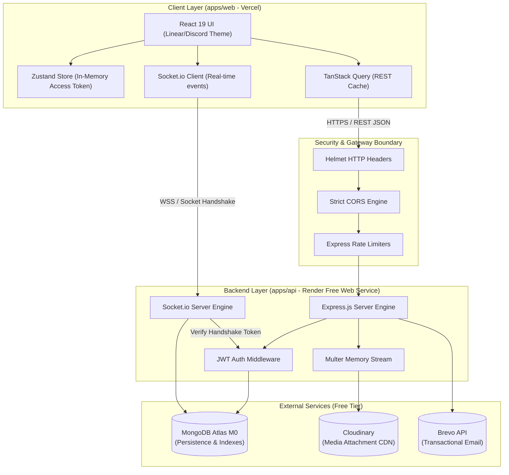
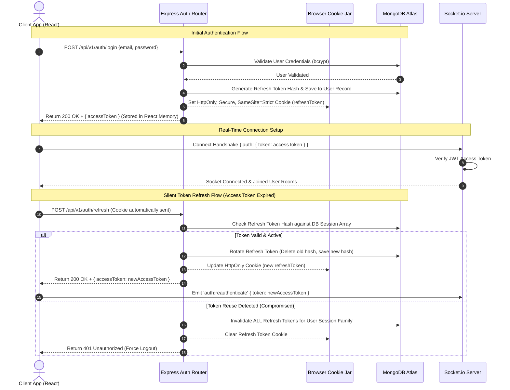

# Virexo Architecture & System Design

## 1. System Overview & Monorepo Structure

Virexo is structured as a unified npm-workspaces monorepo designed for maximum maintainability, shared typing, and clean component isolation.

```
Virexo-Chat-app/
├── apps/
│   ├── web/               # React 19 + Vite + Tailwind CSS Frontend
│   └── api/               # Node.js + Express + Socket.io Backend
├── packages/
│   └── shared/            # Shared TypeScript interfaces, schemas & constants
└── docs/                  # Project specifications & build status tracking
```

---

## 2. High-Level Architecture Diagram



---

## 3. Authentication & Refresh Token Sequence Diagram



---

## 4. Separation of Responsibilities

To maintain clean system boundaries and optimize server resources, Virexo strictly separates REST API operations from Socket.IO real-time event streaming:

### 4.1 REST API Responsibilities (`/api/v1`)
- **Authentication & Session**: User registration, login, logout, token refresh, password reset.
- **Resource Management**: Channel creation, conversation metadata updates, user profile edits.
- **Paginated Data Retrieval**: Fetching historical messages (`/conversations/:id/messages?before=...`), search queries, member rosters.
- **Media Uploads**: Pre-flight validation, Multer memory buffer processing, Cloudinary streaming API dispatch.
- **Administrative & Compliance**: Submitting abuse reports, processing user bans, channel moderation.

### 4.2 Socket.IO Server Responsibilities
- **Instant Message Broadcast**: Pushing newly committed messages to active conversation rooms (`message:created`).
- **Transient State Notifications**: Broadcasting typing indicators (`typing:start`, `typing:stop`) without database persistence.
- **Presence Tracking**: Managing socket join/leave heartbeats and broadcasting user status changes (`user:presence_changed`).
- **Read Receipts**: Emitting real-time read acknowledgments (`message:read`) to conversation members.

---

## 5. Free-Tier Architectural Adaptations

1. **In-Memory Upload Streaming**: Render free instances lack persistent disk storage. Uploads process via `multer.memoryStorage()`, passing binary streams straight to Cloudinary.
2. **Database Connection Pooling**: Mongoose limits pool size (`maxPoolSize: 10`) to prevent exhausting MongoDB Atlas M0's 500-connection ceiling.
3. **Graceful Socket Reconnections**: React Socket client utilizes exponential backoff reconnection strategies to handle automatic server restarts or cold spins on Render.
